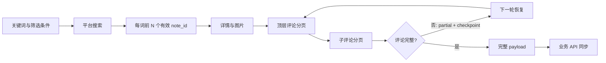

# 小红书采集器

按关键词以平台自然排序采集小红书帖子、图片、顶层评论和全部子评论；通过可恢复的检查点把完整 payload 同步到业务 API。Skill 本身只编排流程，唯一生产入口是外部 [`xiaohongshu-cli`](https://github.com/3Rwcolxxxsar/xiaohongshu-cli) 的 `scrape_and_sync.py`。

## 核心能力

| 能力 | 约束 |
| --- | --- |
| 每个关键词采集前 N 个有效帖子 | 按平台返回顺序，不作本地二次排序 |
| 两层评论分页 | 顶层和子评论均以 cursor 续传、按 comment ID 去重 |
| API 同步 | 评论完整后才上传，避免局部数据覆盖完整数据 |
| 断点恢复 | `partial` 是可恢复状态，不是跳过或成功 |
| 多账号 | 每账号独立 Cookie、锁、缓存和 run-dir；不自动换号绕过风险 |

## 安装

需要 Python 3.10+、[uv](https://docs.astral.sh/uv/)、`xiaohongshu-cli` 项目和已连接的 Kimi WebBridge。

```bash
export XHS_CLI_DIR=/path/to/xiaohongshu-cli
cd "$XHS_CLI_DIR"
uv sync
```

每台设备都必须在真实浏览器重新登录；不要复制 Cookie、浏览器 Profile、token 缓存或 `.xhs-scrape-runs/`。真实上传还需设置业务 API 地址：

```bash
export XHS_SYNC_API_URL=https://example.com/xhs/sync
```

## 快速开始

先把当前已登录的 WebBridge 浏览器会话导入指定账号，并确认不是 guest：

```bash
cd "$XHS_CLI_DIR"
uv run python -m xhs_cli --account worker-a --cookie-source webbridge login --json
uv run python -m xhs_cli --account worker-a --cookie-source saved status --json
```

先做不上传的窄测试：

```bash
uv run python scrape_and_sync.py \
  --cookie-source saved --keyword "加拿大线货代" --limit 1 --dry-run
```

确认后执行同步：

```bash
CONDA_NO_PLUGINS=true uv run python scrape_and_sync.py \
  --account worker-a --cookie-source saved \
  --keyword "加拿大线货代" --keyword "美线货代" \
  --limit 5 --sort general --time all --scope all \
  --api-url "$XHS_SYNC_API_URL" \
  --max-notes-per-run 2 --max-comment-pages-per-run 8
```

## 工作流



运行目录默认为 `.xhs-scrape-runs/`，其中 `manifest.json` 保存关键词、状态和错误；`comments/` 保存顶层/子评论 cursor；`raw/` 保存平台原始响应；`payloads/` 保存待上传内容。文件权限限制为当前用户。

## 断点与风险处理

- `partial`：页预算耗尽后的正常断点；以相同参数和 run-dir 再运行即可恢复。
- 多轮持续 `partial` 而没有 `uploaded/ready`：将 `--max-notes-per-run` 调为 `1`，或把评论页预算提高到 `12–16`。
- 验证码、429、登录失效、IP 拦截或 `risk_paused`：停止该账号，不自动换号或继续探测。
- 同一账号只允许一个运行进程；多账号并行只用于天然不重叠且远端已按 `note_id` 幂等的任务。

## 技术设计

| 层级 | 实现 |
| --- | --- |
| 编排 | Codex skill：`SKILL.md` 与最小化参考规则 |
| 生产入口 | `xiaohongshu-cli/scrape_and_sync.py` |
| 登录 | Kimi WebBridge 导入真实 Chrome 会话 |
| 数据一致性 | note_id / comment ID 去重、两层 cursor checkpoint、完整后上传 |
| 运行安全 | 每账号 RunLock、风险暂停、随机请求间隔、0600 本地状态文件 |

## 目录结构

```text
SKILL.md                       任务路由与运行约束
references/comment-structure.md 评论字段及分页契约
references/partial-deadlock.md 断点空转诊断
references/deployment-package.md 跨机器部署边界
agents/openai.yaml             Codex UI 元数据
```

## 安全边界

不使用 Playwright、Selenium、Camoufox、直接浏览器 Cookie 数据库或平台 API 绕过登录。WebBridge 只用于读取用户已登录的真实浏览器会话；采集请求由 CLI 的签名接口完成。任何 `partial`、`failed` 或 `unavailable` 都必须如实汇报，不能描述为成功同步。
